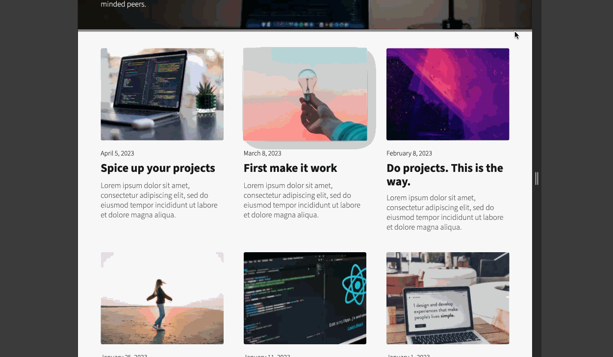

# Learning Journal
Learning Journal is a blog format of webpages with the intent to reflect on learnings as an aspiring developer.  The objective of Learning Journal was to apply responsive design principles and CSS grid to create a set of mobile-first, responsive webpages that adjust to a range screen widths.

## Table of contents

- [Overview](#overview)
  - [The challenge](#the-challenge)
  - [Screenshot](#screenshot)
  - [Links](#links)
- [My process](#my-process)
  - [Built with](#built-with)
  - [What I learned](#what-i-learned)
  - [Continued development](#continued-development)
  - [Useful resources](#useful-resources)
- [Author](#author)
- [Acknowledgments](#acknowledgments)

## Overview

### The challenge

- Implement responsive design principles including:
  - Mobile-first design
  - Media queries
  - Relative units:
    - `ems` & `rems`
    - viewport units (`vh`, `vw`)
  - Percentages for heights and widths
- Use CSS grid for layout

### Demo


### Links

- Live Site URL: [Deployed Learning Journal project](https://jeff-eng-learning-journal.netlify.app/)

## My process

### Built with

- Semantic HTML5 markup
- Vanilla JavaScript
- CSS custom properties
- Flexbox
- CSS Grid
- Mobile-first workflow

### What I learned

#### CSS Grid
```css
.grid--posts {
    margin-top: 2.13em;
    padding: 0 clamp(0.75em, 5vw, 3.313em);
    grid-template-columns: repeat(auto-fit, minmax(240px, 1.5fr));
    gap: 2.563em;
}
```
  - `auto-fit` creates new columns to the row when the max size of the grid item set in `minmax` is exceeded and vice-versa when shrinking the viewport.
  

```css
grid-template-rows: repeat(3, max-content);
```
  - `fr` units for CSS grid to divide a row/column into fractional units
  - `minmax` function
  - `repeat` function
  - `grid-template-columns` and `grid-template-rows`

#### Clamp function
```css
.hero-post__body {
        font-size: clamp(0.8rem, 1rem, 1.5rem);
        grid-column: 1 / 11;
    }
```
  - `clamp(min, val, max)` takes three arguments: **_min value_**, **_preferred value_**, **_max value_**; the value that is used is determined by the size of the viewport. Using this function helped elements scale smoothly without needing to use media queries to set font sizes at specific breakpoints.

#### Relative units
```css
.blog-post__title {
  font-size: clamp(1.3rem, 3.5vw, 1.5rem);
  min-height: 1.25em;
}
```
  - **rem** (relative em) - used primarily for font sizing. Using rem unit allows user to be in control of the font sizing of the page. 
```css
.blog-post__title {
  font-size: clamp(1.3rem, 3.5vw, 1.5rem);
  min-height: 1.25em;
}
```
  - **em** - Can be used in place of pixel values. Learned that ems should not be used for font sizing because of the potential compounding effect if parent element font size changes, which affects the font size of a child element that uses `em` for font sizing. `em` is appropriate for margin and padding.

```css
.main-container {
    padding: 2em clamp(0.75em, 5vw, 3.313em) 0;
}
```
  - **vw** / **vh** - Viewport width / viewport height (viewport units) - scales in proportion to percentage of the viewport width/height. `5vw` translates to 5% of viewport width (maximum of 100 `vw` or `vh` units).

#### Media queries
```css
@media (min-width: 750px) {
    .hero-post__link {
        grid-column: 1 / 9;
    }

    .hero-post__body {
        grid-column: 1 / 10;
    }   
}
```

#### Complex Pseudoclass selector(s)
```css
.hamburger-menu:has(input:focus-visible)::before,
.hamburger-menu:has(input:focus-visible)::after,
.hamburger-menu input:focus-visible {
    border: 1px solid var(--background);    
    box-shadow: 0 0 0 1px var(--background);    
}
```

### Continued development

This project was an excellent exercise in applying responsive design principles. I look forward to using CSS Grid for layouts in future projects.

### Useful resources

- [CSS Only Hamburger menu](https://youtu.be/dAIVbLrAb_U?si=ZNvuSmOyV_X9AskA) - This helped me implement a hamburger menu on my mobile screen sizes using CSS only.
- [Learn CSS Grid](https://scrimba.com/learn/cssgrid) - This free Scrimba course really helped me improve my understanding CSS Grid and all of its various properties.

### Conventions
- BEM (Block__Element--Modifier) naming convention for CSS classes

## Author

- [Jeff Eng](https://www.jeffeng.com)
- X (formerly Twitter) - [@elev8eng](https://www.twitter.com/elev8eng)


